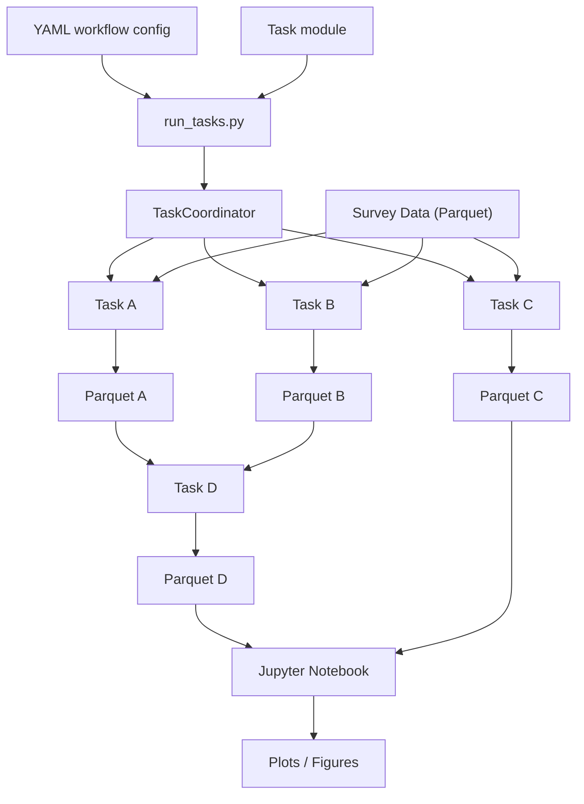
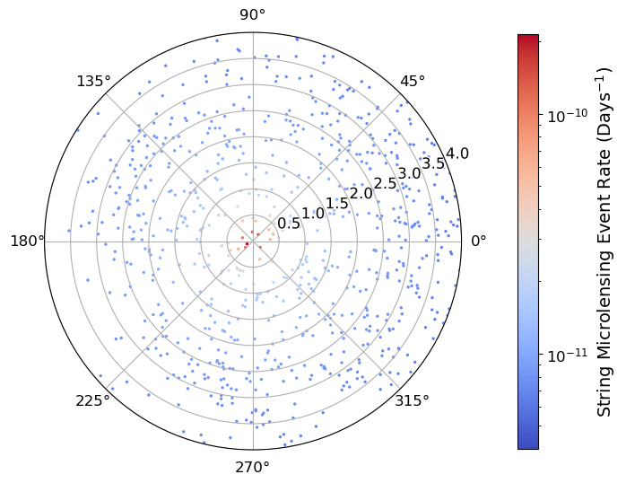

# StringMicrolensing

## Scientific software for cosmic superstring microlensing analysis built around a modular ETL pipeline.

StringMicrolensing contains the software developed during my Ph.D. research. It is a collection of Python tools for 
processing astronomical survey data, generating simulated microlensing events, estimating survey sensitivity, and 
modeling expected event rates. In addition, it contains a modular ETL (Extract, Transform, Load) pipeline used to 
build reproducible workflows and generate intermediate data products. Analysis stages are implemented as modular
components (`ETLTask`s) that can be combined into user-defined workflows. 

## Features

- Modular ETL pipeline
- YAML-configured workflows
- Dynamic task discovery and registration
- Intermediate data products stored as Parquet files
- Tools for processing astronomical survey data
- Monte Carlo simulation and survey sensitivity estimation
- Unit tests written with `pytest`
- Example workflow with a small demonstration dataset (planned)

## Repository Structure

| Directory | Description |
|-----------|-------------|
| `pipeline/` | Generic ETL infrastructure, task coordination, and command-line interface |
| `tasks/` | Modular ETL tasks implementing the analysis |
| `microlensing/` | Shared helper functions |
| `notebooks/` | Visualization and exploratory analysis |
| `tests/` | Unit tests for the ETL framework and supporting code |
| `scripts/` | Utility scripts used during data preparation. |
| `demo/` (planned) | Example dataset and workflow demonstrating the pipeline |
| `task_yamls/` | YAML workflow configurations for ETL pipelines |


## ETL Pipeline
This repository includes a modular ETL pipeline for scientific data processing. It is built around a base `ETLTask`
class. Subclasses ("tasks") define a transformation from input data products to output data products. An illustrative
workflow diagram is as follows:



## Quick Start (Demo)

Clone the repository:

```bash
git clone https://github.com/adriansh95/StringMicrolensing.git

cd StringMicrolensing/

source setup.sh
```

Create and activate a Python virtual environment (recommended):

```bash
python3 -m venv .venv

source .venv/bin/activate

cd demo/
```

Install the dependencies:

```bash
pip install -r demo_requirements.txt
```

Run the demonstration workflow:

```bash
python ../pipeline/run_tasks.py \
    --task-module demo_tasks \
    --task-yaml demo_yaml/demo.yaml
```

Launch Jupyter:

```bash
jupyter notebook --notebook-dir=notebooks/
```

Open `Demo_plots.ipynb` and run all cells.

You should obtain the figure shown below:


Once you're done you can leave and remove the virtual environment:

```bash
deactivate

rm -rf .venv
```
